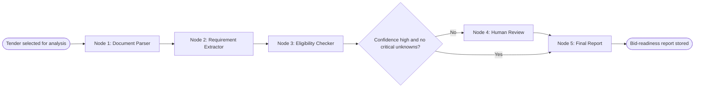

# Agent Workflow Diagram

## What We Are Building

The eligibility agent is a LangGraph workflow that converts tender documents into a structured bid-readiness report. It does not submit bids. It prepares evidence and recommendations for a human reviewer.

## Agent Workflow Diagram

## Node 1: Document Parser

### Purpose

The parser collects text from tender pages, PDFs, and downloaded documents and converts them into clean chunks that later nodes can inspect.

### Why It Exists

LLMs perform better when noisy documents are cleaned and chunked. Tender documents often include tables, scanned pages, repeated headers, and legal boilerplate.

### Common Mistakes

- Sending full documents directly to the LLM without chunking.
- Ignoring tables and annexures.
- Losing page references needed for auditability.

## Node 2: Requirement Extractor

### Purpose

The extractor identifies explicit eligibility and technical requirements such as turnover, certifications, prior experience, EMD, financial documents, and location constraints.

### Why It Exists

Users need structured requirements, not just a summary. A structured checklist allows deterministic comparison with company data.

### Common Mistakes

- Producing vague summaries instead of machine-readable requirements.
- Not capturing evidence text and page references.
- Mixing tender preferences with mandatory requirements.

## Node 3: Eligibility Checker

### Purpose

The checker compares extracted requirements with the company profile and marks each requirement as pass, fail, unknown, or needs review.

### Why It Exists

A company should quickly understand whether the tender is worth pursuing and what gaps must be resolved.

### Common Mistakes

- Treating missing company data as a failure instead of unknown.
- Hiding uncertainty.
- Not explaining why a criterion passed or failed.

## Node 4: Human Review

### Purpose

The human review node pauses or queues the workflow when confidence is low, extracted evidence is ambiguous, or business risk is high.

### Why It Exists

Government bids are high-stakes. Human approval protects users from incorrect AI interpretations.

### Common Mistakes

- Letting the AI silently decide ambiguous requirements.
- Not preserving reviewer notes.
- Not tracking who approved a decision.

## Node 5: Final Report

### Purpose

The report node generates a bid-readiness report with opportunity summary, eligibility matrix, risks, missing documents, and recommended next steps.

### Why It Exists

Decision-makers need a concise, auditable artifact to decide whether to bid.

## Alternative Approaches

### Single Prompt Analysis

One LLM call could read the tender and produce a report.

- Pros: simple to prototype.
- Cons: hard to debug, less reliable, poor human-in-the-loop control.

### Fully Deterministic Extraction

Rules and regex could extract all requirements.

- Pros: cheaper and repeatable.
- Cons: brittle across document formats and legal language.

### LangGraph Workflow

- Pros: explicit state, node-level tracing, branching, human review support.
- Cons: requires more upfront design.

TenderMind-AI chooses LangGraph because production AI workflows need state, observability, and control points.
