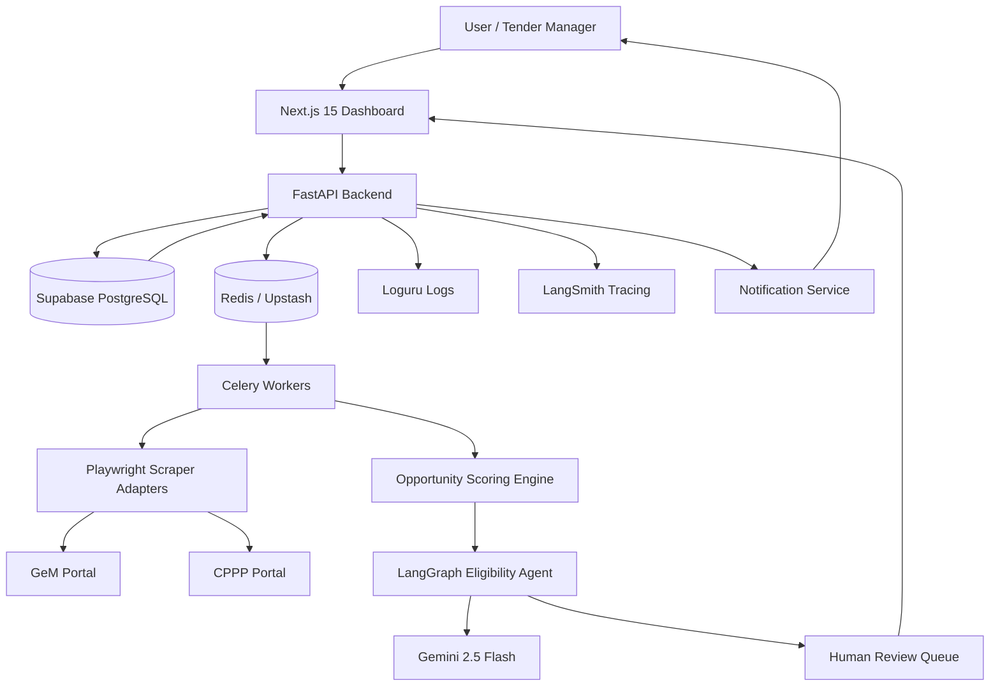

# System Architecture

## What We Are Building

TenderMind-AI uses a modular SaaS architecture with a Next.js frontend, FastAPI backend, PostgreSQL database, Redis-backed background jobs, Playwright scrapers, and a LangGraph eligibility workflow powered by Gemini 2.5 Flash.

## Architecture Diagram

## Why This Architecture Exists

The architecture separates responsibilities so each part can evolve independently:

- The frontend focuses on user experience.
- The API owns validation, authorization, and business workflows.
- Celery workers handle slow scraping and document analysis outside request-response paths.
- PostgreSQL stores source-of-truth business data.
- Redis coordinates background jobs.
- LangGraph models the multi-step AI workflow.
- LangSmith and Loguru make failures observable.

## Core Components

### Frontend: Next.js 15

Next.js gives the project a modern SaaS dashboard foundation with routing, server components, API integration, and Vercel deployment support.

### Backend: FastAPI

FastAPI is a strong fit because it provides typed request models, automatic OpenAPI documentation, async support, and clean integration with Pydantic and SQLModel.

### Database: PostgreSQL on Supabase

PostgreSQL is reliable for structured tender, user, company, report, and audit data. Supabase provides a generous free tier and managed database operations.

### Background Jobs: Celery + Redis

Scraping and AI document analysis are not instant. Celery allows these tasks to run asynchronously, retry on failure, and avoid blocking API requests.

### Scraping: Playwright

Playwright controls a real browser, which is useful for JavaScript-heavy tender portals, dynamic forms, pagination, and downloads.

### AI Workflow: LangGraph + LangChain

LangGraph is used because eligibility analysis is a stateful workflow with multiple nodes, branching, human review, and final report generation.

## Industry Use Cases

- Procurement intelligence platforms.
- Government sales pipeline automation.
- Compliance pre-screening tools.
- RFP response readiness systems.
- B2B sales opportunity monitoring.

## Alternative Architectures

### Monolithic Backend Only

A single FastAPI app could scrape, analyze, and serve UI data.

- Pros: simpler deployment.
- Cons: long-running tasks can block requests and make failures harder to isolate.

### Serverless Functions Only

Scraping and analysis could run as serverless functions.

- Pros: scales down cheaply.
- Cons: browser automation and long document workflows may exceed execution limits.

### Event-Driven Microservices

Every module could be a separate service.

- Pros: highly scalable.
- Cons: too complex for a beginner project and unnecessary at this stage.

## Selected Tradeoff

TenderMind-AI uses a modular monolith plus background workers. This keeps the codebase understandable while still following production engineering patterns.

## Best Practices

- Keep scraping logic isolated behind portal-specific adapters.
- Make background jobs idempotent.
- Store raw extracted data separately from normalized business data.
- Use typed schemas at API and database boundaries.
- Log correlation IDs for long workflows.
- Trace LLM calls and agent decisions.
- Keep humans in control of high-risk decisions.
