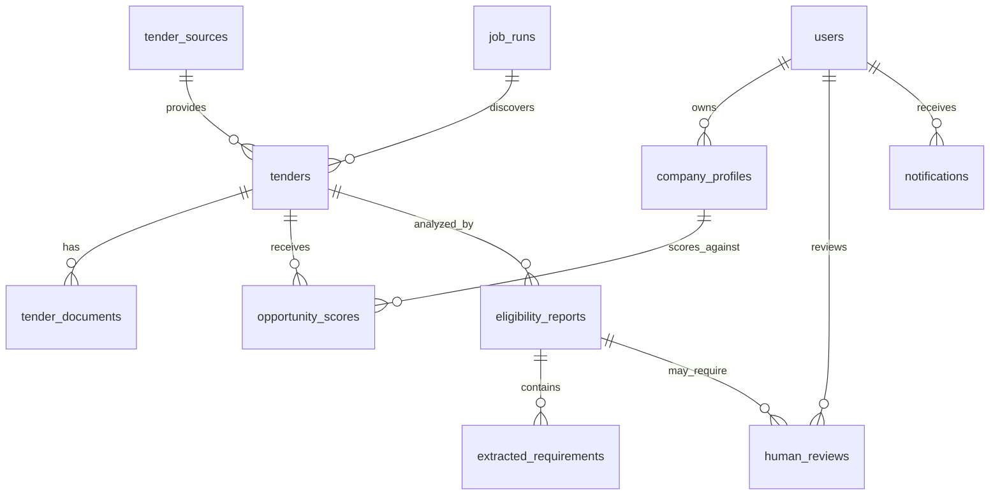

# Database Schema

## What We Are Building

This schema models tenders, company profiles, scoring results, extracted requirements, eligibility reports, human reviews, notifications, and job runs.

## Entity Relationship Diagram

## Tables

### users

Stores application users.

| Column | Type | Notes |
|---|---|---|
| id | uuid | Primary key |
| email | text | Unique |
| full_name | text | Display name |
| created_at | timestamptz | Audit timestamp |

### company_profiles

Stores the business facts used for filtering and eligibility checks.

| Column | Type | Notes |
|---|---|---|
| id | uuid | Primary key |
| user_id | uuid | Owner |
| company_name | text | Legal or trade name |
| industries | text[] | Preferred sectors |
| locations | text[] | Preferred operating regions |
| annual_turnover | numeric | Used for financial eligibility |
| certifications | text[] | ISO, MSME, OEM, etc. |
| experience_keywords | text[] | Past work categories |
| min_project_value | numeric | Scoring preference |
| max_project_value | numeric | Scoring preference |
| created_at | timestamptz | Audit timestamp |
| updated_at | timestamptz | Audit timestamp |

### tender_sources

Stores supported portals.

| Column | Type | Notes |
|---|---|---|
| id | uuid | Primary key |
| name | text | GeM, CPPP |
| base_url | text | Portal URL |
| is_active | boolean | Enables/disables source |

### tenders

Stores normalized tender metadata.

| Column | Type | Notes |
|---|---|---|
| id | uuid | Primary key |
| source_id | uuid | Portal source |
| external_ref | text | Portal tender reference |
| title | text | Tender title |
| buyer_name | text | Procuring entity |
| category | text | Product/service category |
| location | text | Delivery or work location |
| estimated_value | numeric | Nullable because many portals omit value |
| published_at | timestamptz | Publication date |
| closes_at | timestamptz | Submission deadline |
| portal_url | text | Source page |
| status | text | open, closed, archived |
| raw_payload | jsonb | Raw extracted metadata for debugging |
| created_at | timestamptz | Audit timestamp |
| updated_at | timestamptz | Audit timestamp |

### tender_documents

Stores references to tender documents.

| Column | Type | Notes |
|---|---|---|
| id | uuid | Primary key |
| tender_id | uuid | Parent tender |
| document_url | text | Source URL |
| storage_path | text | Future object storage path |
| document_type | text | PDF, corrigendum, annexure |
| extracted_text | text | Parsed text |
| checksum | text | Deduplication |
| created_at | timestamptz | Audit timestamp |

### opportunity_scores

Stores explainable filter scores.

| Column | Type | Notes |
|---|---|---|
| id | uuid | Primary key |
| tender_id | uuid | Scored tender |
| company_profile_id | uuid | Profile used |
| total_score | integer | 0-100 |
| industry_score | integer | 0-30 |
| project_size_score | integer | 0-25 |
| location_score | integer | 0-20 |
| timeline_score | integer | 0-25 |
| reasons | jsonb | Explainability details |
| created_at | timestamptz | Audit timestamp |

### eligibility_reports

Stores output of the LangGraph workflow.

| Column | Type | Notes |
|---|---|---|
| id | uuid | Primary key |
| tender_id | uuid | Analyzed tender |
| company_profile_id | uuid | Compared profile |
| status | text | draft, needs_review, approved, rejected |
| readiness_score | integer | 0-100 |
| executive_summary | text | Report summary |
| risks | jsonb | Risk list |
| missing_documents | jsonb | Required but unavailable docs |
| recommended_next_steps | jsonb | Suggested actions |
| agent_trace_id | text | LangSmith trace reference |
| created_at | timestamptz | Audit timestamp |
| updated_at | timestamptz | Audit timestamp |

### extracted_requirements

Stores requirement-level evidence.

| Column | Type | Notes |
|---|---|---|
| id | uuid | Primary key |
| eligibility_report_id | uuid | Parent report |
| requirement_type | text | turnover, certification, experience, technical |
| description | text | Requirement statement |
| required_value | text | Structured or textual requirement |
| evidence | text | Source excerpt |
| source_reference | text | Page or document reference |
| decision | text | pass, fail, unknown, needs_review |
| confidence | numeric | 0.0-1.0 |

### human_reviews

Stores manual approval and correction events.

| Column | Type | Notes |
|---|---|---|
| id | uuid | Primary key |
| eligibility_report_id | uuid | Reviewed report |
| reviewer_id | uuid | User reviewer |
| decision | text | approved, rejected, changes_requested |
| notes | text | Human rationale |
| created_at | timestamptz | Audit timestamp |

### notifications

Stores user-facing notifications.

| Column | Type | Notes |
|---|---|---|
| id | uuid | Primary key |
| user_id | uuid | Recipient |
| tender_id | uuid | Optional tender context |
| type | text | new_match, report_ready, review_needed |
| title | text | Notification title |
| message | text | Notification body |
| read_at | timestamptz | Nullable |
| created_at | timestamptz | Audit timestamp |

### job_runs

Stores scraper and workflow job history.

| Column | Type | Notes |
|---|---|---|
| id | uuid | Primary key |
| job_type | text | scrape, score, eligibility_analysis |
| status | text | running, succeeded, failed, retrying |
| started_at | timestamptz | Start time |
| finished_at | timestamptz | End time |
| error_message | text | Failure details |
| metadata | jsonb | Job-specific context |

## Important Design Decisions

### Use UUID Primary Keys

UUIDs are suitable for distributed systems and avoid exposing sequential business volume in URLs.

### Store Raw Payloads

Raw portal data helps debug parser changes and portal layout changes without immediately re-scraping.

### Store Score Breakdowns

Users should understand why a tender matched. A single opaque score would not be trustworthy.

### Store Requirement Evidence

Every AI extraction should be traceable to source text. This supports auditability and human review.

## Possible Improvements

- Add row-level security policies in Supabase.
- Add organizations and teams for multi-user companies.
- Add object storage for tender PDFs.
- Add vector search for semantic tender retrieval.
- Add audit log table for all user and agent actions.
